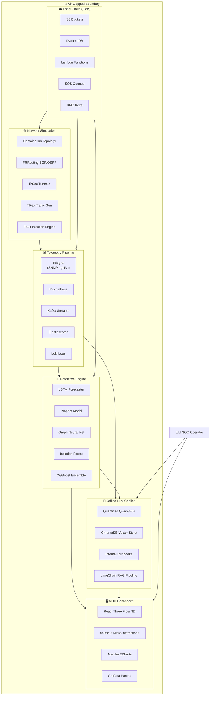
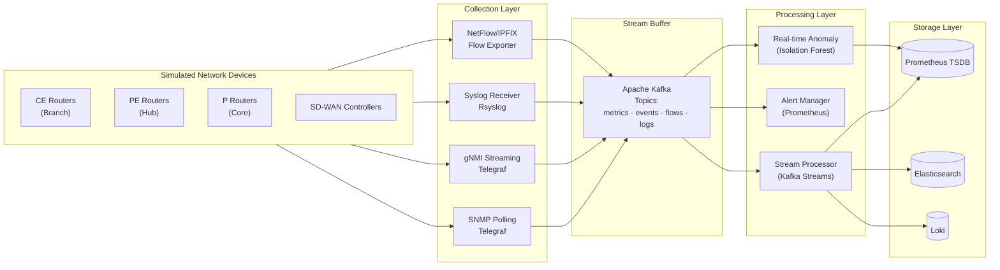
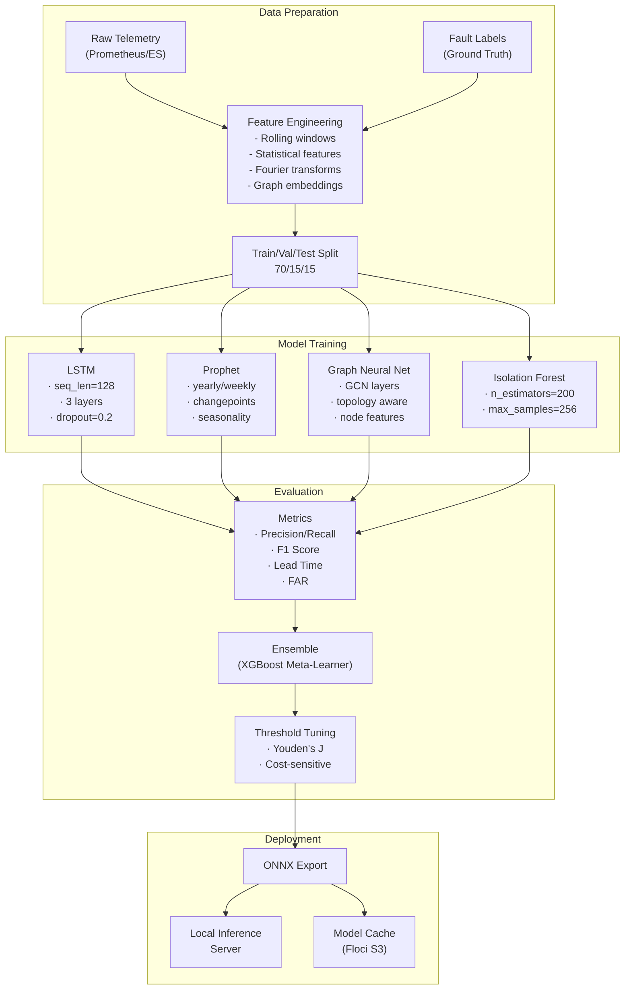
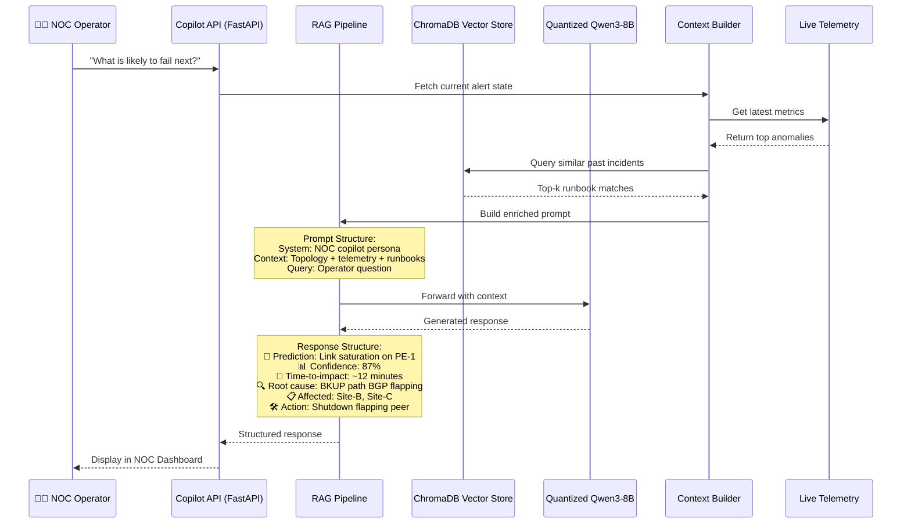
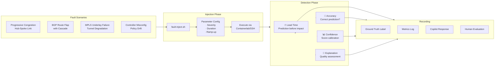
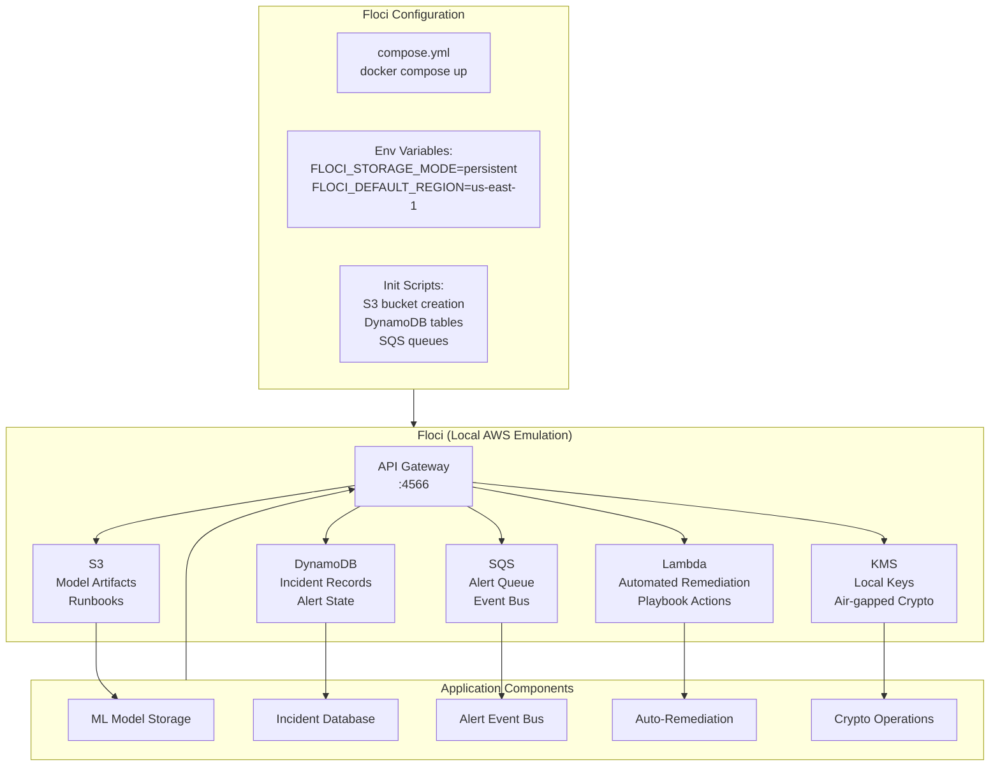
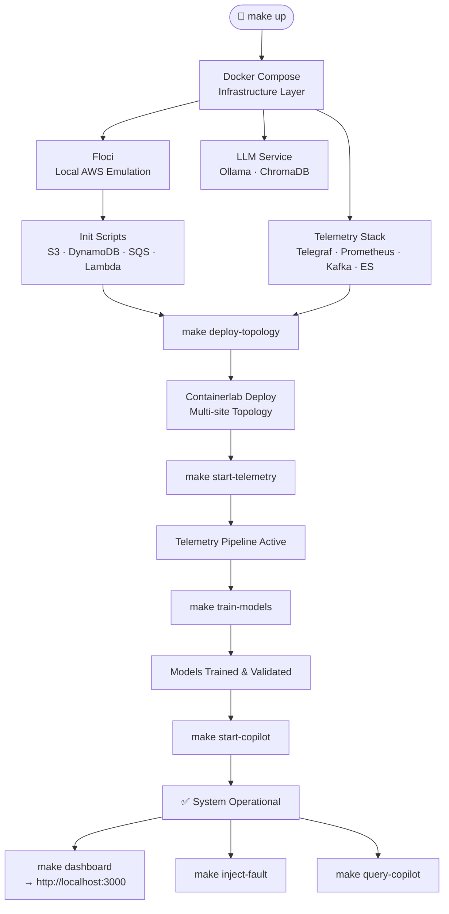
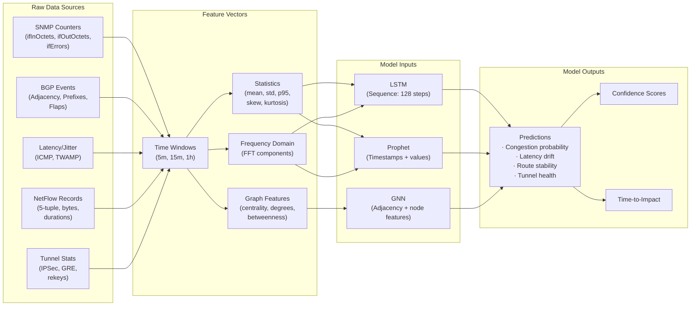

# 🌊 Software & Technology Flowcharts

> **Visual architecture of the Air-Gapped Predictive Copilot**
>
> All diagrams use Mermaid.js — render them on [mermaid.live](https://mermaid.live) or in any Mermaid-compatible viewer (GitHub, Obsidian, VS Code).

---

## 1. System Architecture Overview

---

## 2. Telemetry Pipeline Flow

---

## 3. ML Training Pipeline

---

## 4. LLM Copilot Inference Flow

---

## 5. Fault Injection & Validation Flow

---

## 6. Floci Local AWS Integration

---

## 7. Deployment & Orchestration Flow

---

## 8. Data Flow Between Components

---

> *All flowcharts rendered with Mermaid.js v11+. Edit and preview at [mermaid.live](https://mermaid.live).*
