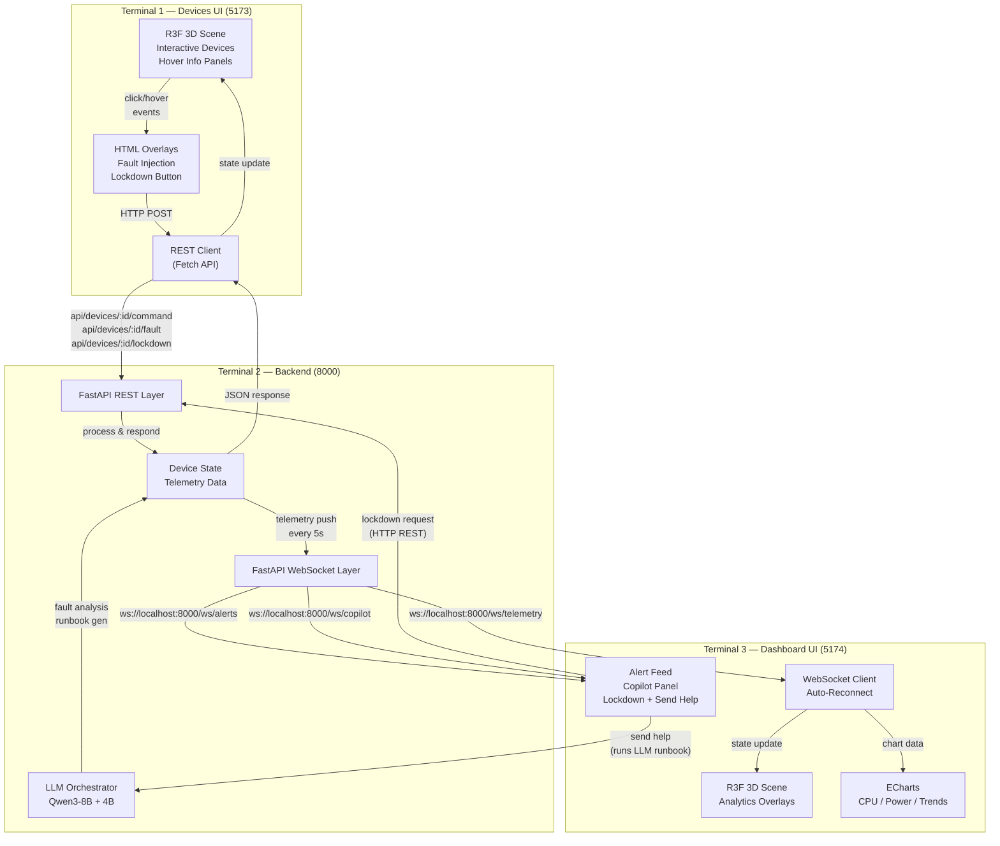
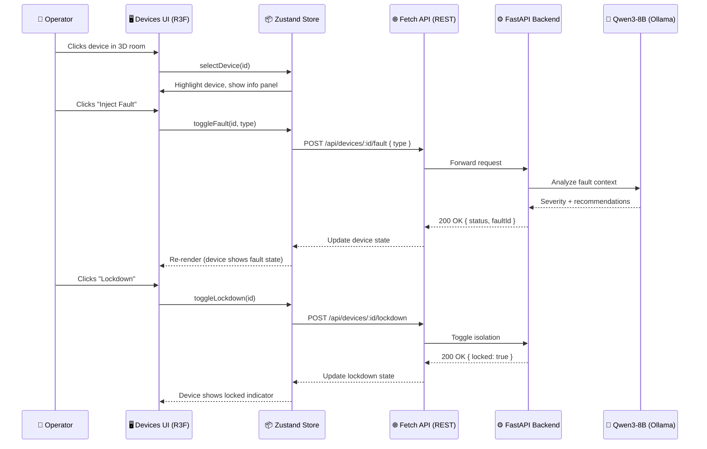
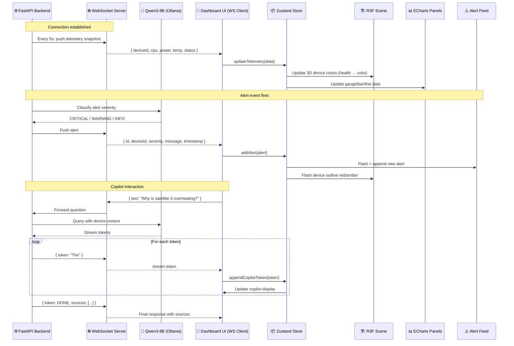

# 🔄 Data & Interaction Flows

## 3-Terminal Architecture Flow



## Data Flow — REST Path (Devices UI ↔ Backend)



## Data Flow — WebSocket Path (Backend → Dashboard UI)



## User Interaction Flow — Devices UI

```
┌─────────────────────────────────────────────┐
│           DEVICES UI INTERACTION MAP          │
├─────────────────────────────────────────────┤
│                                              │
│  ┌──────────────┐                            │
│  │ 3D NOC Room  │  Camera orbit (OrbitControls)│
│  │  Loaded      │  Devices rendered in 3D     │
│  └──────┬───────┘                            │
│         │                                     │
│         ▼                                     │
│  ┌──────────────┐   mouse hover               │
│  │ Device Node   │─────────────────────────▶  │
│  │ [Hover]      │   Show info panel           │
│  └──────┬───────┘   (Anime.js enter)          │
│         │                                     │
│         ▼                                     │
│  ┌──────────────┐                             │
│  │ Device Panel │  Displays:                  │
│  │ (Anime.js)   │  - Name, type, status       │
│  │              │  - Telemetry summary        │
│  │              │  - Fault buttons            │
│  │              │  - Lockdown button          │
│  └──────┬───────┘                             │
│         │                                     │
│         ├──────────▶ "Inject Fault"           │
│         │              POST /api/devices/:id/fault│
│         │              → Device shows red pulse │
│         │                                     │
│         └──────────▶ "Lockdown"               │
│                      POST /api/devices/:id/lockdown│
│                      → Device shows lock icon  │
│                      → Network lines disabled   │
└─────────────────────────────────────────────┘
```

## User Interaction Flow — Dashboard UI

```
┌─────────────────────────────────────────────┐
│         DASHBOARD UI INTERACTION MAP          │
├─────────────────────────────────────────────┤
│                                              │
│  ┌──────────────┐   WebSocket auto-updates   │
│  │ 3D Room      │◀─────────────────────────  │
│  │ + Overlays   │   Telemetry data flows     │
│  └──────┬───────┘   Device colors update     │
│         │                                     │
│         ▼                                     │
│  ┌──────────────────────────────┐             │
│  │ Alert Feed (auto-scroll)    │             │
│  │  • 🔴 CRITICAL: Sat 3 temp │──click──▶  │
│  │  • 🟡 WARNING: Antenna 1   │  Select     │
│  │  • 🔵 INFO: Rover diagnostic│  device     │
│  └──────────────────────────────┘             │
│         │                                     │
│         ▼                                     │
│  ┌──────────────────────────────┐             │
│  │ Copilot Q&A Panel           │             │
│  │ [Operator]: "What's wrong   │             │
│  │             with Sat 3?"    │──send──▶   │
│  │ [Copilot]: "Satellite 3 is │             │
│  │  overheating. Recommend    │◀──stream──  │
│  │  reducing power draw..."   │  LLM tokens  │
│  └──────────────────────────────┘             │
│         │                                     │
│         ├──────────▶ "Lockdown Device"        │
│         │              POST /api/devices/:id/lockdown│
│         │                                     │
│         └──────────▶ "Send Help"              │
│                        WebSocket → LLM        │
│                        Generate runbook       │
└─────────────────────────────────────────────┘
```

## Dual Data Path Summary

```
                    ┌───────────┐
                    │  Operator │
                    └─────┬─────┘
                          │
            ┌─────────────┴─────────────┐
            │                           │
            ▼                           ▼
    ┌───────────────┐         ┌──────────────────┐
    │ Devices UI    │         │ Dashboard UI     │
    │ REST Client   │         │ WebSocket Client │
    └───────┬───────┘         └────────┬─────────┘
            │                          │
            │ HTTP POST/GET            │ WebSocket (ws://)
            │                          │
            ▼                          ▼
    ┌─────────────────────────────────────────┐
    │          FastAPI Backend :8000           │
    │                                          │
    │  REST Layer          WebSocket Layer     │
    │  ┌──────────┐       ┌──────────────┐    │
    │  │ CRUD     │       │ /ws/telemetry│    │
    │  │ Commands │       │ /ws/alerts   │    │
    │  │ Config   │       │ /ws/copilot  │    │
    │  └──────────┘       │ /ws/status   │    │
    │                     └──────────────┘    │
    └─────────────────────────────────────────┘
```

## Connection Lifecycle

### REST (Devices UI)
```
Request ──▶ Backend processes ──▶ Response ──▶ Connection closed
```
Stateless. Each interaction opens a fresh HTTP connection.

### WebSocket (Dashboard UI)
```
1. Client connects:  new WebSocket('ws://localhost:8000/ws/telemetry')
2. Server accepts:   WebSocket connection established
3. Server pushes:    { telemetry data } every 5s
4. Client receives:  Store update → R3F re-render
5. On disconnect:    Auto-reconnect with exponential backoff (1s, 2s, 4s, 8s...)
6. Heartbeat:        Ping/pong every 30s to keep alive
```

## Port Allocation

| Port | Service | Protocol | Assigned To |
|------|---------|----------|-------------|
| 5173 | Devices UI | HTTP (Vite dev server) | Terminal 1 |
| 8000 | FastAPI Backend | HTTP + WebSocket | Terminal 2 |
| 5174 | Dashboard UI | HTTP (Vite dev server) | Terminal 3 |
