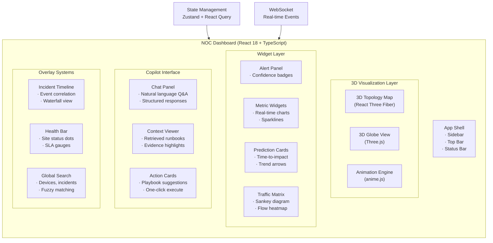

# 🖥️ NOC Dashboard — Frontend Architecture

> **3D WebGL-powered NOC Command Center with anime.js micro-interactions**

---

## 🎯 Design Philosophy

The NOC Dashboard is designed for **situational awareness under stress**. Every visual element serves a purpose:

- **Glanceability** — critical information at a glance from 3 feet away
- **Spatial reasoning** — 3D topology maps leverage innate human spatial cognition
- **Motion for attention** — micro-animations guide attention to emerging issues
- **Dark-optimized** — NOC operators work 24/7 in dimly lit environments

---

## 🏗 Component Architecture



---

## 🎨 Design System

### Color Palette

| Token | Hex | Usage |
|-------|-----|-------|
| `--bg-primary` | `#0a0e17` | Main background (space black) |
| `--bg-secondary` | `#111827` | Card backgrounds |
| `--bg-glass` | `rgba(17, 24, 39, 0.7)` | Glassmorphism panels |
| `--accent-cyan` | `#00d4ff` | Healthy links, positive metrics |
| `--accent-blue` | `#3b82f6` | Primary actions, focus states |
| `--accent-amber` | `#f59e0b` | Warning states, medium priority |
| `--accent-red` | `#ef4444` | Critical alerts, errors |
| `--accent-green` | `#22c55e` | Good health, confirmed |
| `--accent-purple` | `#a855f7` | ML predictions, AI insights |
| `--text-primary` | `#f8fafc` | Primary text |
| `--text-secondary` | `#94a3b8` | Secondary/muted text |

### Glassmorphism Cards

```css
.dashboard-card {
  background: rgba(17, 24, 39, 0.7);
  backdrop-filter: blur(12px);
  -webkit-backdrop-filter: blur(12px);
  border: 1px solid rgba(255, 255, 255, 0.05);
  border-radius: 16px;
  box-shadow: 0 8px 32px rgba(0, 0, 0, 0.3);
}
```

### Typography

| Element | Font | Weight | Size |
|---------|------|--------|------|
| Headings | `JetBrains Mono` | 700 | 1.5–2.5 rem |
| Body | `Inter` | 400 | 0.875–1 rem |
| Data/Metrics | `JetBrains Mono` | 500 | 0.75–1.25 rem |
| Alert Text | `JetBrains Mono` | 600 | 0.875 rem |

---

## 🌐 3D Network Visualization (Three.js / React Three Fiber)

### Scene Components

```
Scene
├── Ambient Light (soft, blue-tinted)
├── Point Lights (per node, color-coded by health)
├── OrbitControls (operator interaction)
├── Network Graph
│   ├── Nodes (CE, PE, P routers)
│   │   ├── Mesh (icosahedron for routers)
│   │   ├── Glow (pulsing based on load)
│   │   └── Label (device name + IP)
│   ├── Edges (links)
│   │   ├── Cylinder geometry
│   │   ├── Color (green → amber → red based on utilization)
│   │   ├── Thickness (proportional to bandwidth)
│   │   └── Particle flow (traffic animation)
│   └── Groups (site clusters: Branch, Hub, DC)
├── Rings (orbit rings around critical nodes)
├── Grid (reference plane, subtle)
└── Post-processing
    ├── Bloom (emissive highlights)
    ├── FXAA (anti-aliasing)
    └── Vignette (focus attention)
```

### Key 3D Interactions

| Interaction | Implementation |
|-------------|---------------|
| **Click node** | Zoom to node, show detail panel |
| **Hover edge** | Highlight path, show latency/jitter |
| **Scroll zoom** | Dolly camera in/out |
| **Right-drag** | Pan camera |
| **Hotkey `F`** | Focus on active alert location |
| **Hotkey `G`** | Toggle globe mode (orthographic → perspective) |
| **Auto-rotate** | Gentle camera orbit when idle (15s timeout) |

### Traffic Particle System

```typescript
// Pseudo-code for animated traffic particles along links
class TrafficParticles {
  particles: BufferGeometry;
  material: PointsMaterial;
  velocities: Float32Array;

  constructor(edgeCount: number) {
    // Create particles on each edge
    // Each edge has 20-50 particles
    // Particles flow from source → destination
    // Speed proportional to bandwidth utilization
    // Color transitions: green → yellow → red
  }

  update(delta: number) {
    // Move particles along edge path
    // Wrap around when reaching destination
    // Update colors based on current utilization
    // Pulse particles during alert events
  }
}
```

---

## ✨ anime.js Micro-Interactions

anime.js is used for **performance-safe, declarative animations** across the dashboard.

### Animation Registry

```typescript
import { animate, stagger } from 'animejs';

// ─── Alert Panel ──────────────────────────────────
// New alert slides in from the right with a pulse glow
animate('.alert-item-new', {
  x: [100, 0],
  opacity: [0, 1],
  duration: 400,
  ease: 'outExpo'
});

// ─── Alert Severity Badge ─────────────────────────
// Critical alerts get a breathing pulse animation
animate('.badge-critical', {
  scale: [1, 1.05, 1],
  opacity: [1, 0.8, 1],
  duration: 2000,
  loop: true,
  ease: 'inOutSine'
});

// ─── Network Edge Health ──────────────────────────
// When a link degrades, the edge gets a warning flash
animate('.edge-warning', {
  stroke: ['#22c55e', '#f59e0b', '#ef4444'],
  duration: 1200,
  direction: 'alternate',
  loop: 3,
  ease: 'inOutQuad'
});

// ─── Metric Counter ───────────────────────────────
// Numbers count up when a new value arrives
animate('.metric-value', {
  innerHTML: [0, newValue],
  duration: 800,
  round: 1,
  ease: 'outCubic'
});

// ─── Prediction Card ──────────────────────────────
// Confidence score radial bar fills with a delay
animate('.confidence-ring', {
  strokeDashoffset: [100, 0],
  duration: 1500,
  delay: 500,
  ease: 'outCubic'
});

// ─── Status Dot Pulse ─────────────────────────────
// Site health dots pulse gently when stable
animate('.status-dot', {
  scale: [1, 1.3, 1],
  opacity: [1, 0.7, 1],
  duration: 3000,
  loop: true,
  ease: 'inOutSine',
  delay: stagger(200)
});

// ─── Incident Timeline ────────────────────────────
// Timeline events stagger in on load
animate('.timeline-item', {
  y: [30, 0],
  opacity: [0, 1],
  delay: stagger(60),
  ease: 'outQuad'
});

// ─── Traffic Flow Density ──────────────────────────
// Pulse intensity on high-traffic edges
animate('.traffic-particle', {
  opacity: [0.3, 1],
  scale: [1, 1.5],
  duration: 1000,
  direction: 'alternate',
  loop: true,
  delay: stagger(50)
});

// ─── Typing Effect for Copilot ────────────────────
// LLM responses type out character by character
animate('.copilot-response', {
  opacity: [0, 1],
  duration: 300,
  ease: 'linear'
});
// (Typing managed by character reveal in React state)
```

---

## 📊 Real-Time Charts (Apache ECharts)

| Chart | Data | Configuration |
|-------|------|---------------|
| **Bandwidth Utilization** | Per-link TX/RX bps | Area chart, gradient fill, 5min window |
| **Latency Heatmap** | All-pairs latency matrix | 2D heatmap, auto-adjusted bins |
| **Prediction Timeline** | Forecasted metrics | Confidence interval bands, dashed forecast |
| **Alert Waterfall** | Severity × time | Stacked bar, categorical colors |
| **Traffic Sankey** | Inter-site traffic | Sankey diagram, flow width proportional to volume |
| **Route Stability** | BGP prefix count | Step line, annotations for flaps |
| **Tunnel Health** | IPSec SA status | Gauge cards with mini sparklines |
| **Copilot Confidence** | Score distribution | Radar chart, multi-dimensional |

---

## 🧩 Component Tree

```
src/
├── App.tsx                          # Root with React Router
├── main.tsx                         # Vite entry point
│
├── layouts/
│   ├── DashboardLayout.tsx          # Main dashboard shell
│   ├── Sidebar.tsx                  # Navigation sidebar
│   └── StatusBar.tsx                # Bottom status bar
│
├── pages/
│   ├── Overview.tsx                 # Main overview page
│   ├── Topology.tsx                 # Full 3D topology view
│   ├── Alerts.tsx                   # Alert management
│   ├── Copilot.tsx                  # Full copilot chat view
│   ├── Analytics.tsx                # Deep analytics
│   ├── Runbooks.tsx                 # Runbook browser
│   └── Settings.tsx                 # Dashboard settings
│
├── components/
│   ├── three/
│   │   ├── NetworkGraph.tsx         # 3D network visualization
│   │   ├── NodeMesh.tsx             # Individual network node
│   │   ├── EdgeLine.tsx             # Network link between nodes
│   │   ├── TrafficParticles.tsx     # Traffic flow particles
│   │   ├── GlobeView.tsx            # 3D globe map mode
│   │   ├── SiteCluster.tsx          # Site grouping visualization
│   │   └── CameraController.tsx     # Camera orbit controls
│   │
│   ├── widgets/
│   │   ├── AlertPanel.tsx           # Prioritized alert list
│   │   ├── MetricCard.tsx           # Single metric display
│   │   ├── PredictionCard.tsx       # ML prediction display
│   │   ├── TrafficMatrix.tsx        # Traffic flow matrix
│   │   ├── HealthBar.tsx            # Site health indicators
│   │   ├── SLAComb.tsx              # SLA compliance gauges
│   │   └── Timeline.tsx             # Incident timeline
│   │
│   ├── copilot/
│   │   ├── ChatPanel.tsx            # Q&A chat interface
│   │   ├── CopilotResponse.tsx      # Structured response card
│   │   ├── ContextViewer.tsx        # Retrieved context display
│   │   ├── ActionCard.tsx           # Recommended action
│   │   └── ConfidenceBadge.tsx      # Confidence score display
│   │
│   ├── charts/
│   │   ├── BandwidthChart.tsx       # Time-series bandwidth
│   │   ├── LatencyHeatmap.tsx       # Latency matrix
│   │   ├── AlertWaterfall.tsx       # Alert timeline
│   │   ├── TrafficSankey.tsx        # Traffic flow diagram
│   │   └── RouteStability.tsx       # BGP stability chart
│   │
│   └── ui/
│       ├── GlassCard.tsx            # Glassmorphism card
│       ├── StatusDot.tsx            # Animated status dot
│       ├── Badge.tsx                # Severity/status badge
│       ├── Button.tsx               # Custom button with ripple
│       ├── Modal.tsx                # Glass modal dialog
│       └── SearchBar.tsx            # Global search
│
├── hooks/
│   ├── useWebSocket.ts             # WebSocket connection
│   ├── useTelemetry.ts             # Real-time metric stream
│   ├── useAnimations.ts            # anime.js controller
│   ├── useKeyboard.ts              # Hotkey bindings
│   └── useCopilot.ts               # Copilot API hook
│
├── stores/
│   ├── alertStore.ts               # Zustand alert state
│   ├── topologyStore.ts            # Network topology state
│   ├── telemetryStore.ts           # Real-time metrics store
│   └── uiStore.ts                  # UI state (theme, sidebar)
│
├── styles/
│   ├── globals.css                 # Tailwind + custom CSS
│   ├── animations.css              # anime.js keyframes
│   ├── glassmorphism.css           # Glass effect utilities
│   └── themes.css                  # Dark/light theme vars
│
└── utils/
    ├── formatters.ts               # Data formatting utils
    ├── colors.ts                   # Health color mapping
    └── websocket.ts               # WebSocket client
```

---

## 🔌 WebSocket Events

| Event | Direction | Payload |
|-------|-----------|---------|
| `telemetry:update` | Server → Client | `{ deviceId, metrics, timestamp }` |
| `alert:new` | Server → Client | `{ id, severity, title, confidence, prediction }` |
| `alert:resolved` | Server → Client | `{ id, resolvedAt }` |
| `topology:change` | Server → Client | `{ type, nodeId, state }` |
| `copilot:response` | Server → Client | `{ queryId, response, context }` |
| `prediction:update` | Server → Client | `{ modelId, predictions, timestamp }` |

---

## 🚀 Tech Stack

| Library | Version | Purpose |
|---------|---------|---------|
| React | 18.3+ | UI framework |
| TypeScript | 5.5+ | Type safety |
| Vite | 6.x | Build tool |
| Three.js | r170+ | 3D rendering |
| React Three Fiber | 8.x | React bindings for Three.js |
| Drei | 9.x | R3F utilities |
| anime.js | 4.4+ | Micro-interactions |
| Apache ECharts | 5.5+ | Charts |
| Zustand | 5.x | State management |
| React Query | 5.x | Server state |
| Tailwind CSS | 3.4+ | Utility-first CSS |
| Radix UI | latest | Accessible primitives |
| Socket.IO | 4.7+ | Real-time WebSocket |

---

## 🎬 Demo Animations

### Loading Screen

```typescript
import { animate } from 'animejs';

// Animated ISRO logo + system initialization progress
animate('#loading-ring', {
  rotate: 360,
  duration: 2000,
  loop: true,
  ease: 'linear'
});

animate('#loading-progress', {
  width: ['0%', '100%'],
  duration: 3000,
  ease: 'inOutCubic',
  onComplete: () => { /* transition to dashboard */ }
});
```

### Alert Siren Effect

When a critical alert fires, the entire dashboard header pulses red twice:

```typescript
animate('.dashboard-header', {
  backgroundColor: [
    'rgba(239, 68, 68, 0)',
    'rgba(239, 68, 68, 0.15)',
    'rgba(239, 68, 68, 0)',
    'rgba(239, 68, 68, 0.1)',
    'rgba(239, 68, 68, 0)'
  ],
  duration: 1500,
  ease: 'steps(5)'
});
```

---

> *See [main.md](./main.md) for full system integration details.*
> *See [build.md](./build.md) for frontend build steps.*
